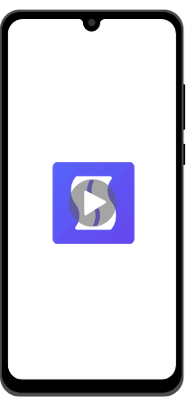

# SnakeChat

SnakeChat is a social media sample application built using Kotlin & Jetpack Compose
for the app and GoLang & SQLite on backend

# Goals

Trying out latest in the mobile development world while monitoring performance, app size & build time,
while maintaining backend with the cheapest means possible, be it writing a functionality in Rust/Zig/C.

# Non Goals

* Listing the app on play/app store and chase downloads/ratings
* Gain active users
* Monetize the app

# Roadmap

* Get the v1 out with Jetpack Compose (✅ done)
* Migrate the data & domain layer to [KMP](https://kotlinlang.org/docs/multiplatform.html)
* Build app using views (XML)
* Short video content
* Realtime Chat
* Over-The-Air (OTA) UI updates using [redwood-treehouse](https://github.com/cashapp/redwood)
* Integrate [Google AdMob test ads](https://developers.google.com/admob/android/test-ads)

# Docs
* [frontend](frontend/README.md)
* [backend](backend/README.md)